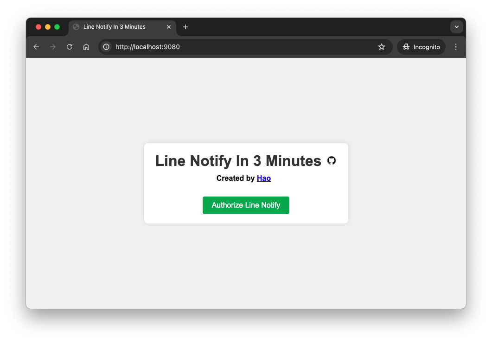
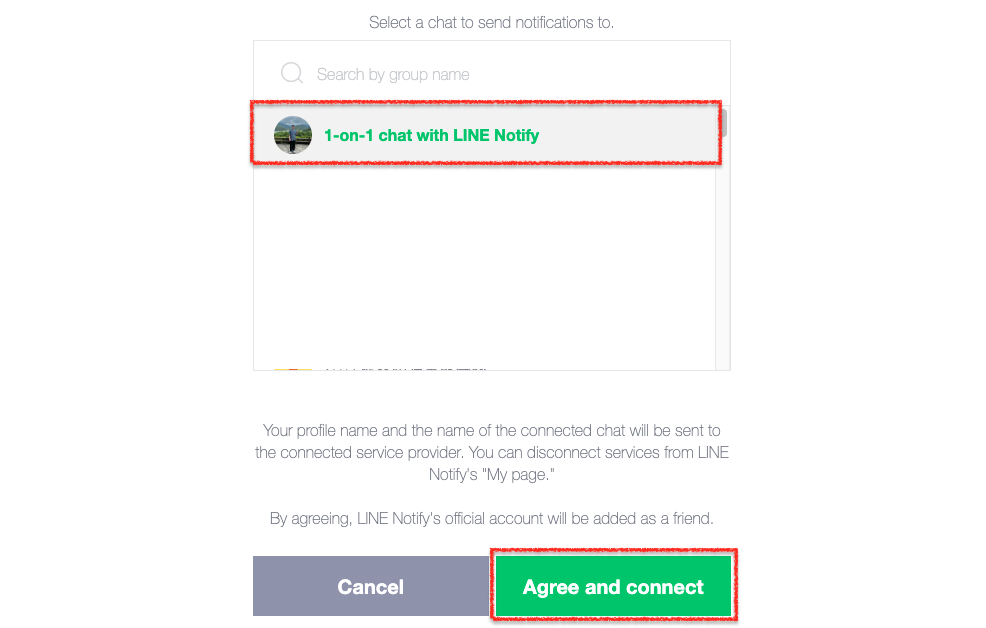
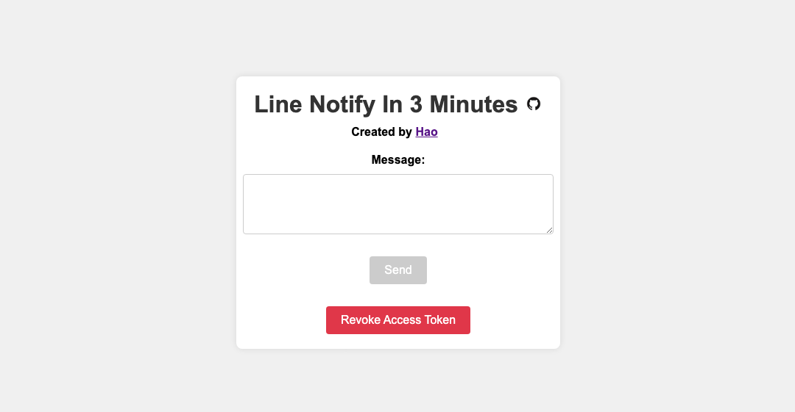

# Line Notify In 3 Minutes

## Add Line Notify Service

1. Go to [Line Notify](https://notify-bot.line.me/my/services/new).
2. Fill in the form and click on the `Agree and Continue` button.

   The following fields must be filled in as:

   | Field        | Value                                                  |
      |--------------|--------------------------------------------------------|
   | Service URL  | `http://localhost:8080`                                |
   | Callback URL | `http://localhost:8080/api/line-notify/exchange-token` |

3. You will then be taken to the confirmation screen, click on `Add` and continue to complete email verification.
4. After verification, you can see the newly added service on the `My Services` page.
5. Enter the service, and you will see the `Client ID` and `Client Secret`, which will be used in the following steps.

## Clone Repository

```bash
git clone https://github.com/yhao3/line-notify-in-3-minutes.git
```

## Configure Environment Variables

```bash
cd line-notify-in-3-minutes
cp env.example .env
```

Edit the `.env` file and fill in the following values:

```properties
SERVER_PORT=8080
LINE_NOTIFY_CLIENT_ID=YOUR_LINE_NOTIFY_CLIENT_ID
LINE_NOTIFY_CLIENT_SECRET=YOUR_LINE_NOTIFY_CLIENT_SECRET
```

> **Note**
>
> The value of `SERVER_PORT` must be the same as the port in the `Service URL` and the port in the `Callback URL` in the Line Notify service!

## Start Application with Docker Compose

```bash
docker compose up -d
```

## Authorize Line Notify

1. Open the browser and go to [`http://localhost:8080/`](http://localhost:8080/).
   
2. Click on the `Authorize Line Notify` button, and you will be redirected to the Line Notify authorization page.
3. Login with your Line account and choose the group or chat you want to send notifications to.
   
4. Click on the `Agree and connect` button, and you will be redirected back to the application.
5. Now you can send notifications to the group or chat you have chosen.
   
6. Have fun!